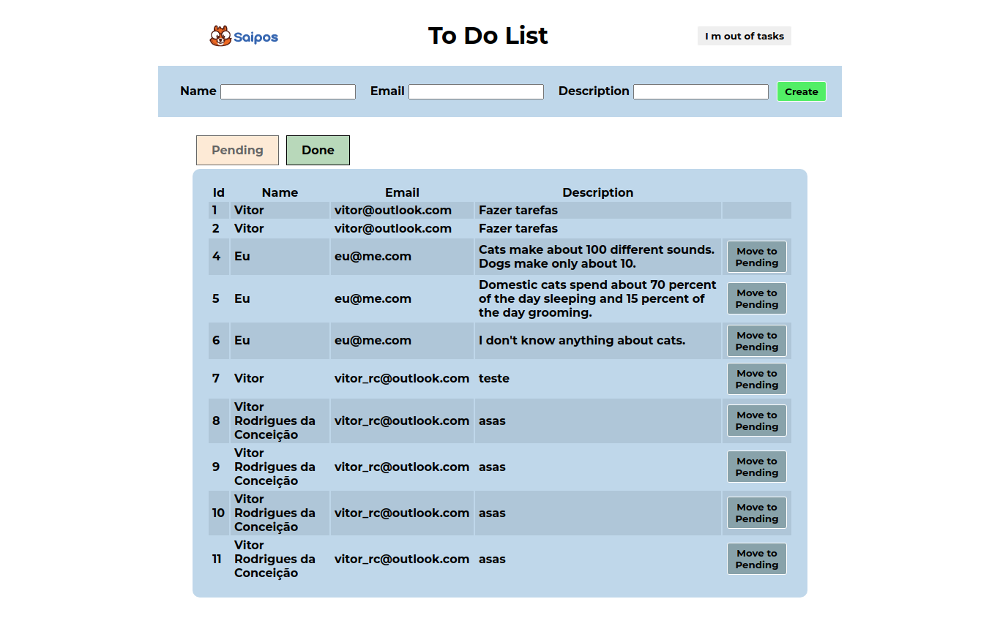

# Getting Started

### Antes de iniciar
- Crie um arquivo **.env** na pasta front-end
- Configure as seguintes variaveis de ambiente

```
REACT_APP_API = endereço do back-end 
```

### Para iniciar este projeto execute os seguintes comandos
### `npm install`
### `npm start`


